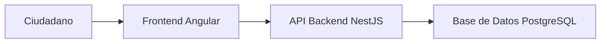
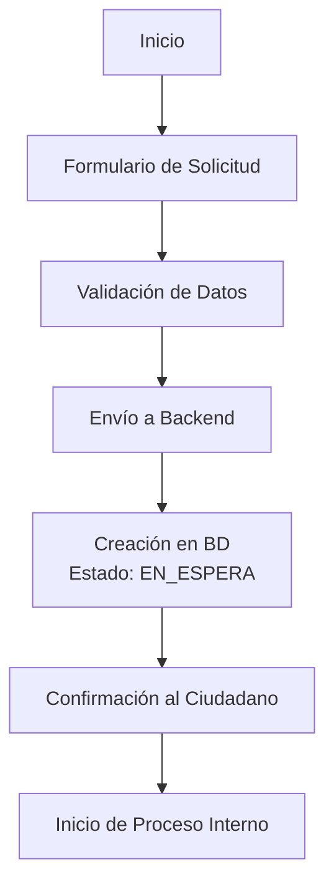

# Frontend FONHVIM - Portal Ciudadano

**Sistema de solicitudes de ayuda social para ciudadanos**

## Descripción

Aplicación Angular para el portal público de FONHVIM. Permite a los ciudadanos:

- Registrar solicitudes de ayuda social
- Consultar estado de sus solicitudes
- Subir documentos requeridos
- Recibir notificaciones

## Arquitectura



## Flujo de Registro de Solicitud



## Estructura del Proyecto

```
front-fonhvim/
├── src/
│   ├── app/
│   │   ├── core/           # Servicios, guards, interceptors
│   │   ├── features/       # Módulos de características
│   │   │   ├── home/       # Página principal
│   │   │   ├── solicitud/  # Registro de solicitudes
│   │   │   ├── estado/     # Consulta de estado
│   │   │   └── auth/       # Autenticación
│   │   └── shared/         # Componentes compartidos
│   ├── assets/             # Imágenes, estilos
│   └── environments/       # Configuración de entornos
├── angular.json
└── package.json
```

## Instalación

```bash
# Instalar dependencias
npm install

# Configurar variables de entorno
cp src/environments/environment.example.ts src/environments/environment.ts
```

## Ejecución

```bash
# Servidor de desarrollo
ng serve

# Construir para producción
ng build

# Ejecutar tests
ng test
```

## Endpoints de Backend Utilizados

| Método | Endpoint | Descripción |
|--------|----------|-------------|
| POST | `/solicitudes` | Crear solicitud |
| GET | `/solicitudes/:id` | Consultar solicitud |
| GET | `/solicitudes/ci/:ci` | Buscar por cédula |
| GET | `/solicitudes/tasa-bcv` | Obtener tasa BCV |

## Validaciones del Formulario

- Cédula única y válida
- Campos requeridos: nombres, dirección, teléfono
- Validación de email opcional
- Documentos adjuntos según tipo de solicitud

## Componentes Principales

- **SolicitudFormComponent**: Formulario de registro
- **EstadoSolicitudComponent**: Consulta de estado
- **DocumentUploadComponent**: Subida de documentos

## Recursos

- [Documentación Técnica](../documentacion_tecnica_solicitud_interno.md)
- [Backend API](../backend-fonhvim/README.md)
- [Panel Interno](../fonhvim-interno/README.md)

## Licencia

MIT License - FONHVIM
